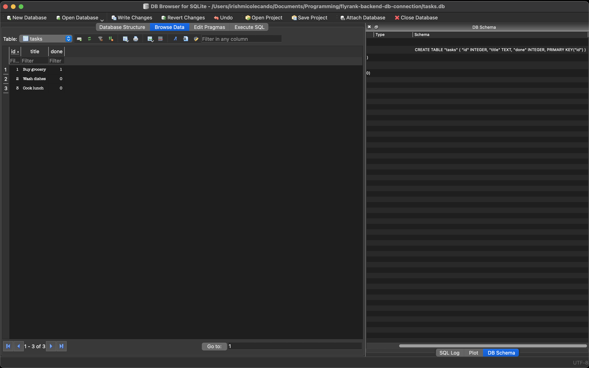

# Task API with SQLite

A simple RESTful CRUD API built with **Node.js**, **Express**, and **SQLite**. This project replaces the in-memory task list from Assignment 1 with a persistent SQLite database, allowing tasks to remain even after the server restarts.

## Why SQLite?

SQLite was chosen because it is:

- Lightweight and serverless
- Easy to set up (no separate database server required)
- Stores data in a single file
- Perfect for small applications, learning projects, and local development

Unlike the previous in-memory implementation, SQLite persists data between application restarts.

---

## Database Location

The database is stored locally in the project root as:

```
tasks.db
```

If the file does not exist, it is automatically created when the application starts.

The `tasks` table is also created automatically using:

```sql
CREATE TABLE IF NOT EXISTS tasks (
    id INTEGER PRIMARY KEY AUTOINCREMENT,
    title TEXT NOT NULL,
    done INTEGER NOT NULL DEFAULT 0
);
```

---

## Installation

Clone the repository:

```bash
git clone <repository-url>
cd <repository-folder>
```

Install dependencies:

```bash
npm install
```

---

## Running the Project

Start the server with:

```bash
node index.js
```

The API will be available at:

```
http://localhost:3000
```

On first startup, the application automatically creates the SQLite database (`tasks.db`) and the `tasks` table if they do not already exist.

---

## API Endpoints

| Method | Endpoint | Description |
|---------|----------|-------------|
| GET | `/tasks` | Get all tasks |
| GET | `/tasks/:id` | Get a task by ID |
| POST | `/tasks` | Create a new task |
| PUT | `/tasks/:id` | Update an existing task |
| DELETE | `/tasks/:id` | Delete a task |

---

## Example SQL Query

Example query executed during development:

```sql
SELECT * FROM tasks;
```

Example update query used by the API:

```sql
UPDATE tasks
SET title = ?, done = ?
WHERE id = ?;
```

---

## Database Viewer

SQLite database viewed using **DB Browser for SQLite**.



---

## Project Structure

```
.
├── index.js
├── package.json
├── package-lock.json
├── tasks.db
└── README.md
```

---

## Automatic Database Creation

The project automatically initializes the database on startup.

When the server starts, it:

1. Creates `tasks.db` if it does not already exist.
2. Creates the `tasks` table if it does not exist.

No manual database setup is required.
